# IN164 - Exercise 1 - Onboard a new trading partner by reference

Log in to the tenant: [IN164 Tenant](https://url.sap/nvxsuf)

User: UserXX, where XX is your participant number. This number is important and will be used in several places during the exercise. Wherever XX is mentioned, replace it with your number.
Please take care to exactly use the same upper and lower case as shown here as otherwise it might not work out of the box. 
You will receive the password from your trainers.
This is the tenant you will work on: [IN164 Tenant](https://url.sap/nvxsuf)

----
----

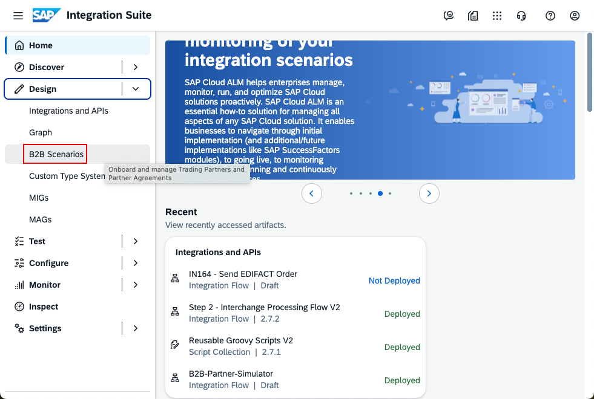

In the left-hand navigation, go to Design -> B2B Scenarios.

----
----

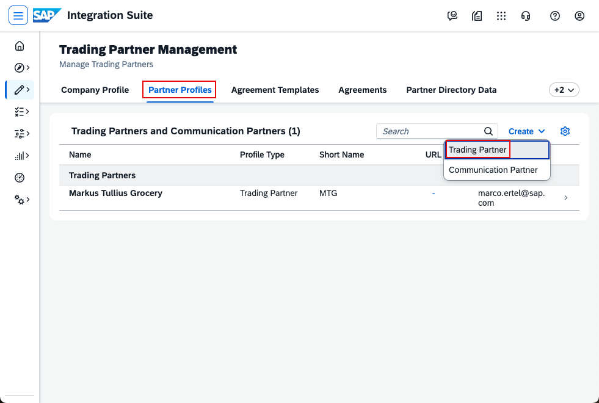

Go to Partner Profiles and click Create, then select Trading Partner.

----
----

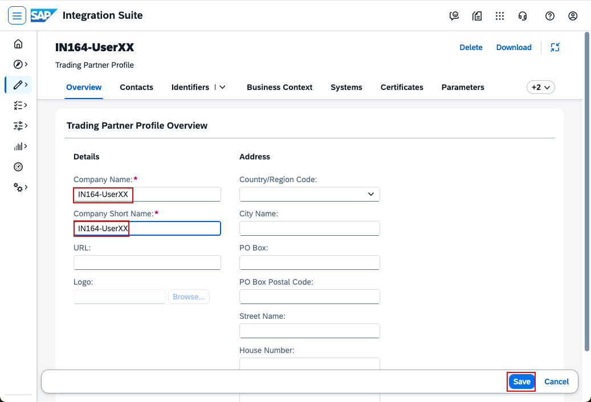

In Overview, enter:
- Company Name: IN164-UserXX (replace XX with your number)
- Company Short Name: IN164-UserXX

----
----

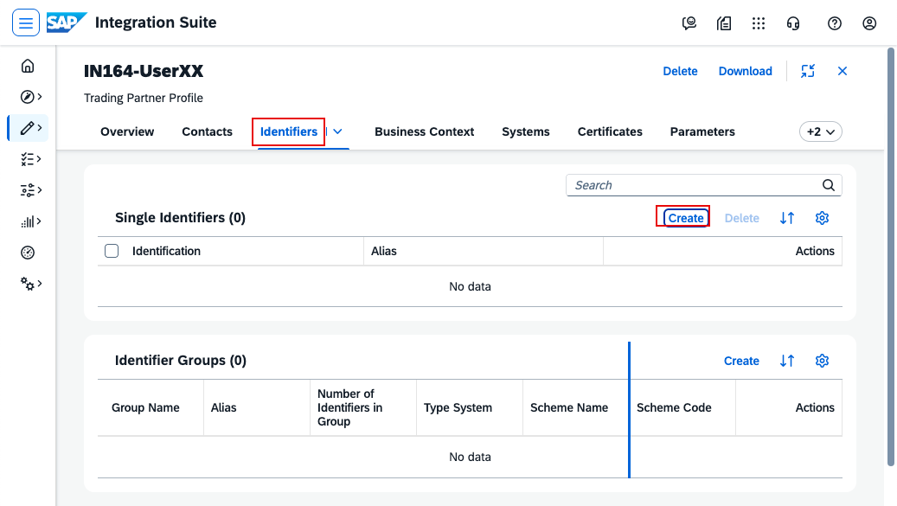

Go to Identifiers and click Create in Single Identifiers.

----
----

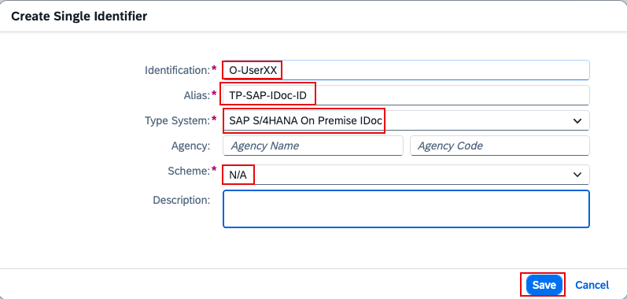

In the pop-up, create the identifier that will later be used in the (simulated) S/4 system. Use the exact casing shown:
- Identification: O-UserXX (this is the letter O, not zero)
- Alias: TP-SAP-IDoc-ID
- Type System: SAP S/4HANA On Premise IDoc
- Scheme: N/A
Save the identifier.

----
----

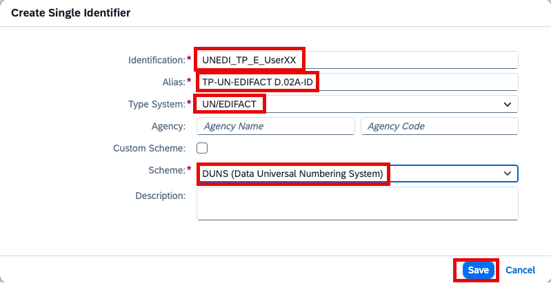

Create another identifier that will later be used in the (simulated) trading partner system. Use the exact casing shown:
- Identification: UNEDI_TP_E_UserXX (replace XX with your number)
- Alias: TP-UN-EDIFACT D.02A-ID
- Type System: UN/EDIFACT
- Scheme: DUNS (Data Universal Numbering System) — use the one with qualifier 1 (there are two DUNS entries)

Save the identifier.
More information around the identifiers can be found here: [Understanding Identifiers in Agreement](https://help.sap.com/docs/integration-suite/sap-integration-suite/understanding-identifiers-in-agreement?locale=en-US)

----
----

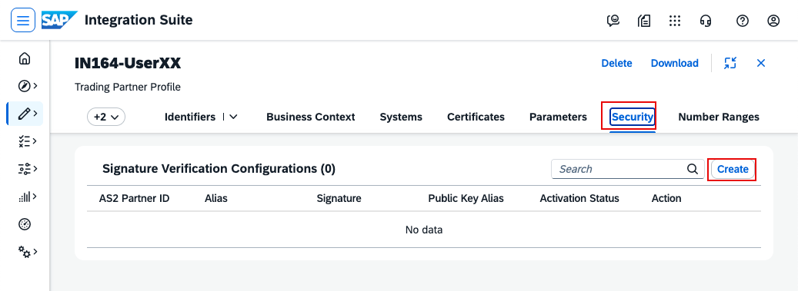

Go to the Security tab and click Create.

----
----

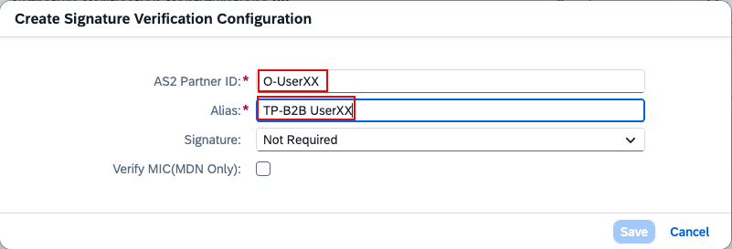

Create the material for the incoming connection with:
- AS2 Partner ID: O-UserXX (letter O, not zero; replace XX with your number)
- Alias: TP-B2B UserXX (replace XX with your number)

Save the configuration.

----
----

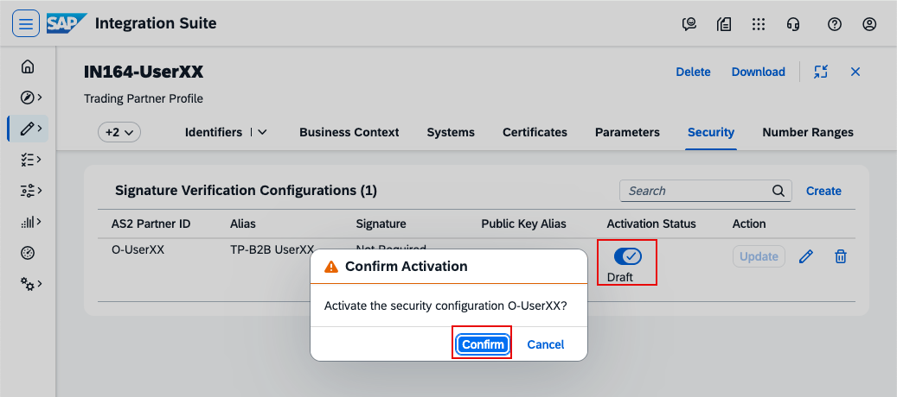

This configuration must be written to the Partner Directory, so you need to activate it. Click the check mark and confirm the activation.

----
----

Next, go to Systems and click Create System.

----
----

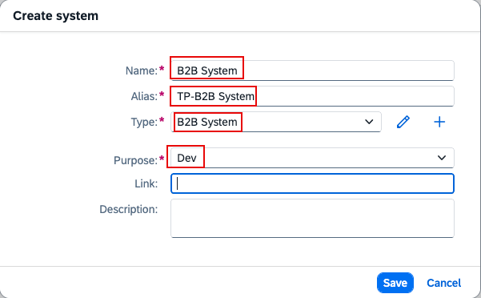

Enter the system details:
- Name: B2B System
- Alias: TP-B2B System
- Type: B2B System
- Purpose: Dev

Click Save.

The purpose influences the [payload indicator](https://help.sap.com/docs/integration-suite/sap-integration-suite/payload-indicator-in-integration-flow-message-processing?locale=en-US) 

Now click on the created system to open it and continue with the exercise.
----
----

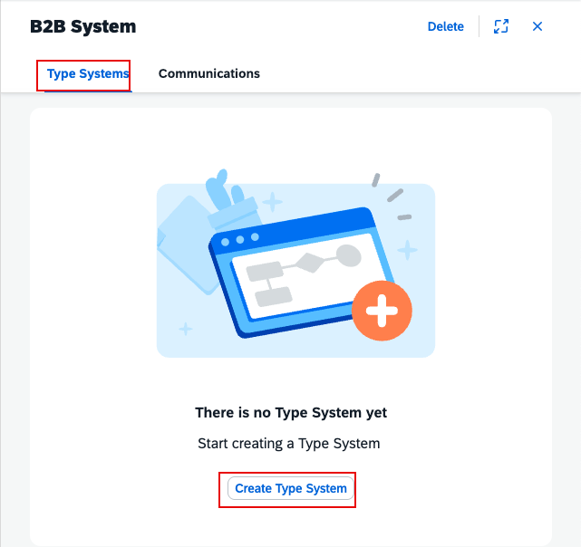

Assign the type system your trading partner will use. Open the newly created system, go to Type Systems, and click Create Type System.

----
----

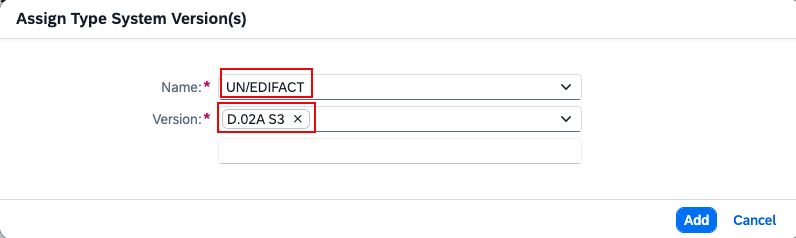

Select UN/EDIFACT and Version D.02A S3, then click Add.

----
----

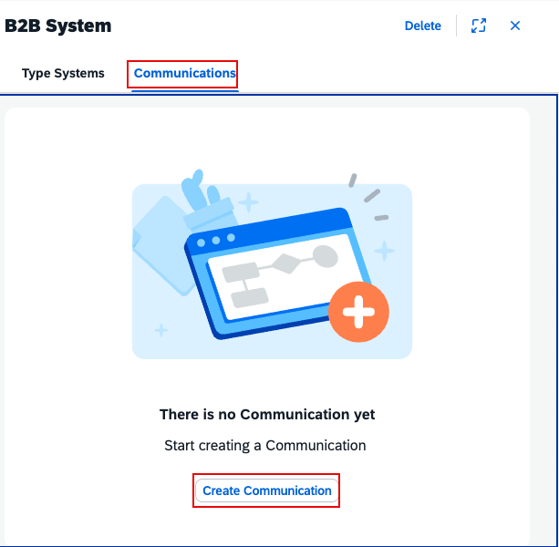

Go to Communications and click Create Communication.

----
----

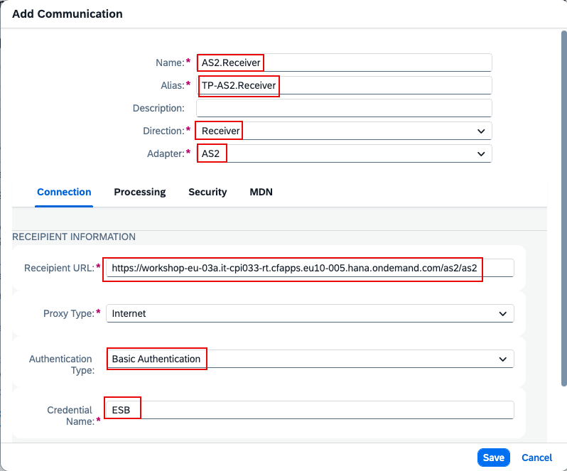

In the Add Communication dialog, enter the details so you can later send the Order Response message to your trading partner:
- Name: AS2.Receiver
- Alias: TP-AS2.Receiver
- Direction: Receiver
- Adapter: AS2

Now, on the Connection tab:
- Recipient URL: https://workshop-eu-03a.it-cpi033-rt.cfapps.eu10-005.hana.ondemand.com/as2/as2
- Authentication Type: Basic Authentication
- Credential Name: ESB

----
----

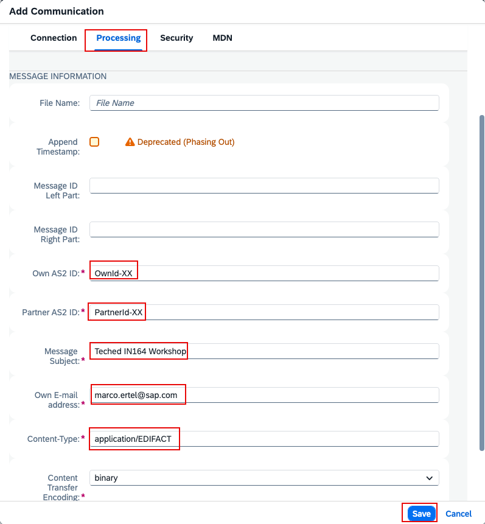

Switch to the Processing tab and complete the remaining required fields:
- Own AS2 ID: OwnId-XX
- Partner AS2 ID: PartnerId-XX
- Message Subject: Teched IN164 Workshop
- Own email address: your email address (you will receive the EDIFACT Order Response message by email)
- Content Type: application/EDIFACT   

Click Save.

----
----

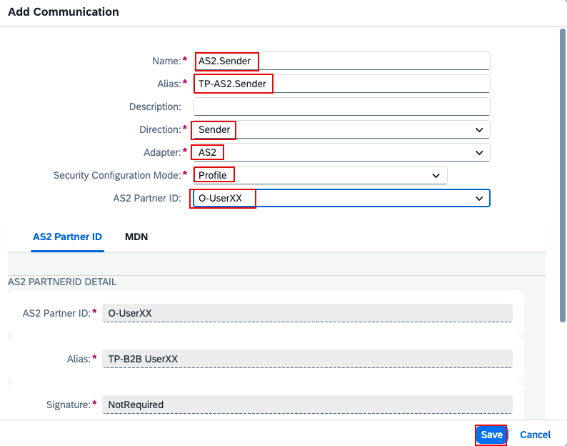

Create the second communication channel so you can receive the EDIFACT Order message from your trading partner:
- Name: AS2.Sender
- Alias: TP-AS2.Sender
- Direction: Sender
- Adapter: AS2
- Security Configuration Mode: Profile
- AS2 Partner ID: O-UserXX (should be prefilled with your number)  
Click Save.

----
----

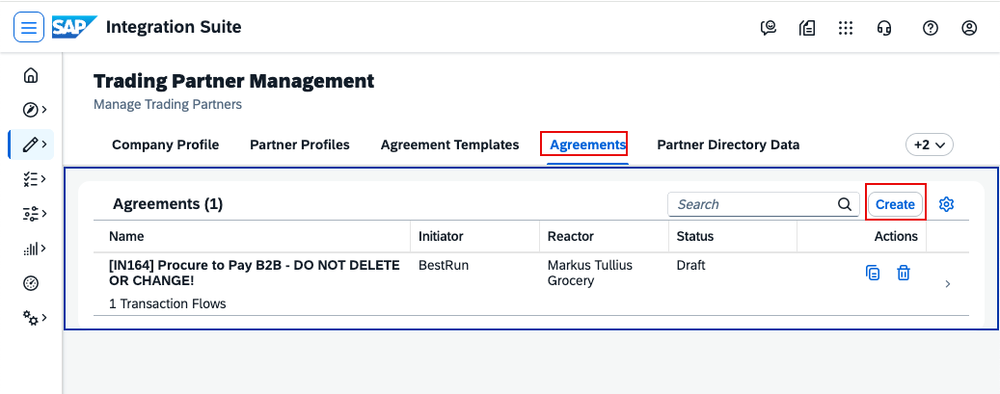

The basic master data of a Trading Partner is maintained now. Next you will learn how-to create a B2B Scenario via the Trading Partner Agreement creation. For this the required Agreement Template with the master data details are already created for you to be used.  
Go to Agreements and click ‘Create’. 

----
----

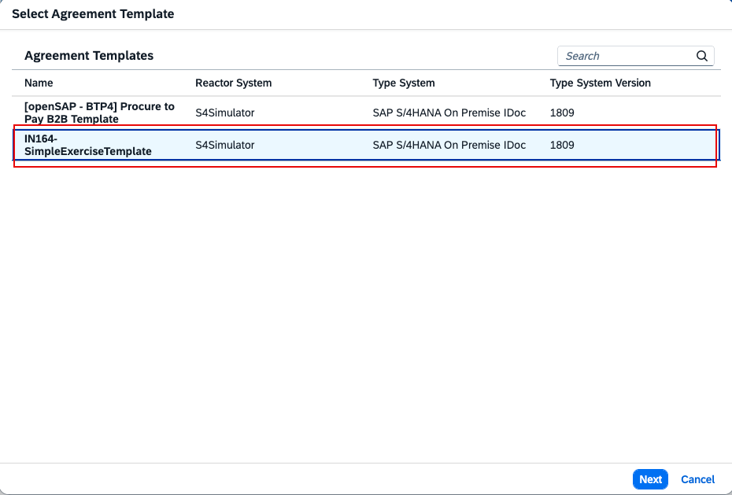

Select the agreement template named IN164-SimpleExerciseTemplate and click Next.

----
----

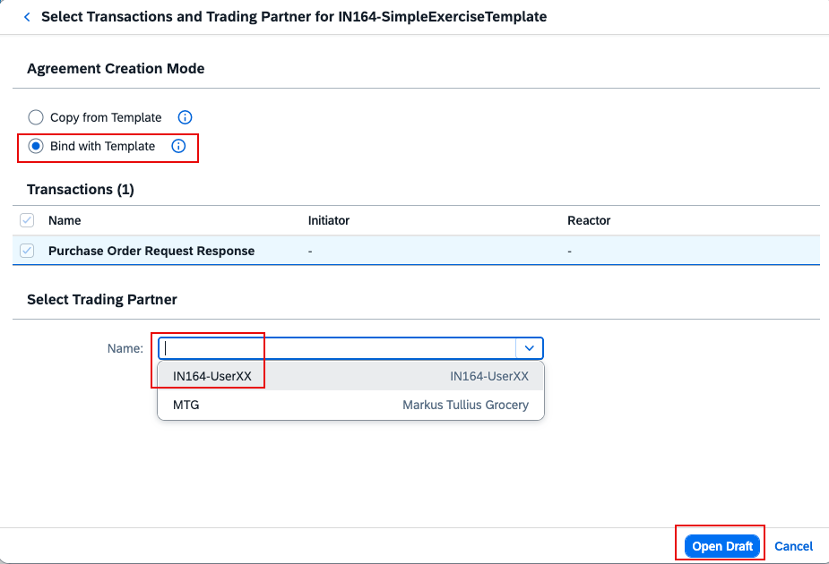

In this exercise, we will use the by-reference variant. This is helpful if all your trading partners expect the same MIG, MAG, etc.
Click Bind with Template, select your trading partner IN164-UserXX in the dropdown, and click Open Draft.

----
----

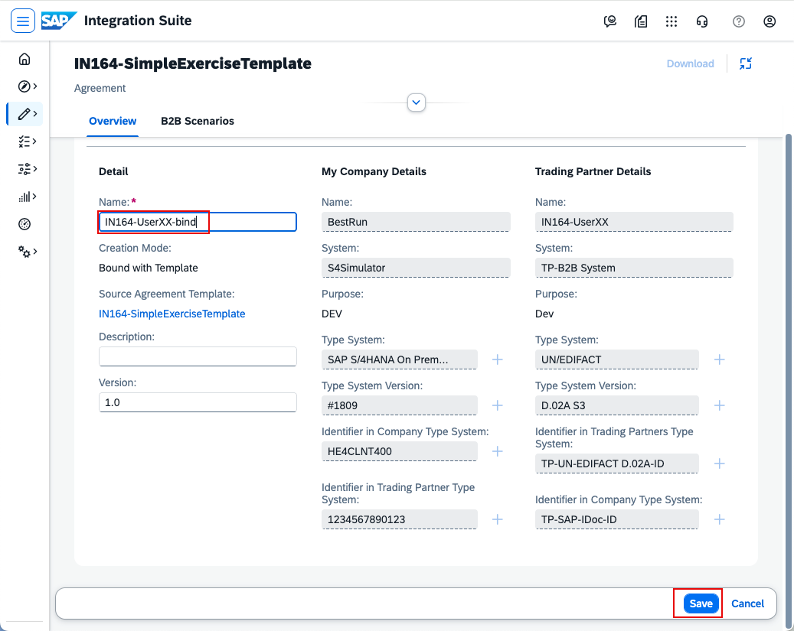

Change the agreement name to IN164-UserXX-bind (replace XX with your number), then click Save.

----
----

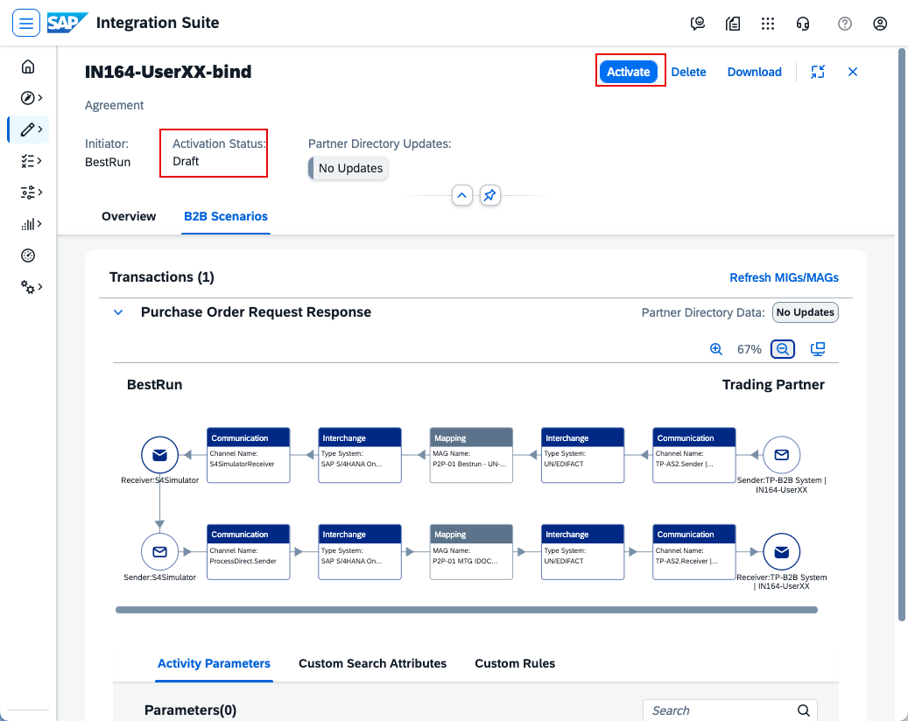
The Agreement created from the template with the "by-reference mode" shows a Two-way business transaction, guided by the UN/CEFACT Modelling Methodology. This B2B scenario involves a structured sequence of business transactions between a company and its trading partner to fulfill contractual obligations. This framework is used for ensuring efficient and compliant business collaborations by clearly defining transaction patterns and activities. 
Let´s see this in action now!  
**Click 'Activate'**. After activation, your trading partner is onboarded and you can proceed to send the first message.

----
----

Continue with: [Exercise 2 - create an iFlow for the test message and send the message](Exercise-2.md)

Please give us feedback for this session **IN164**

