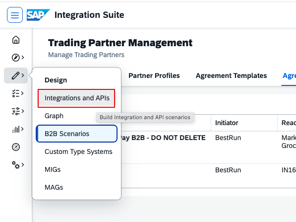
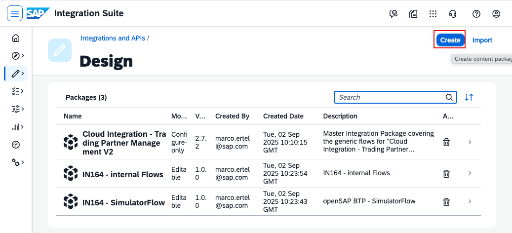
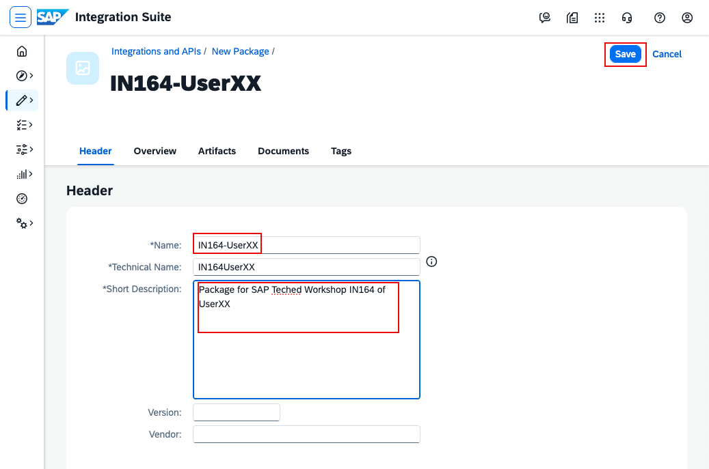
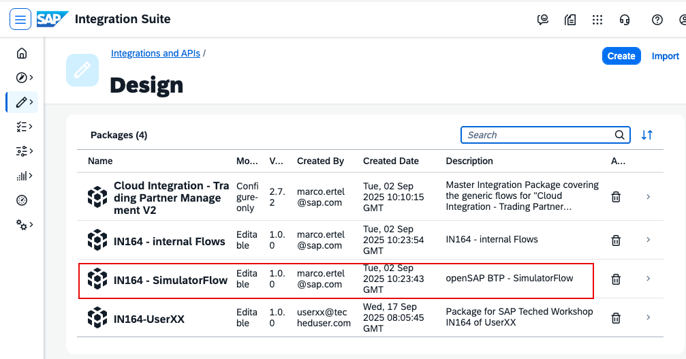
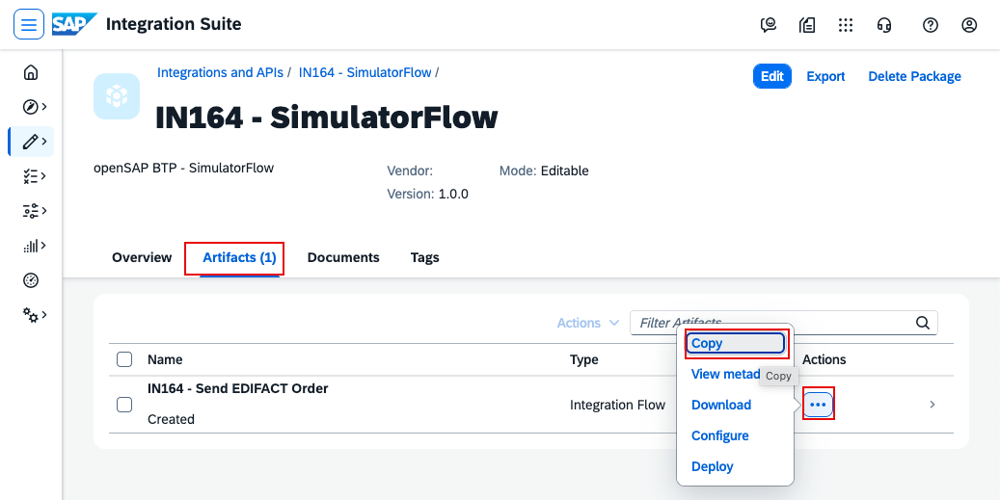
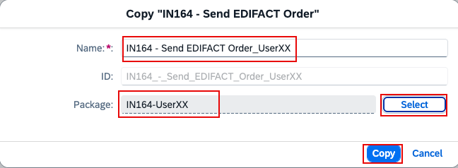
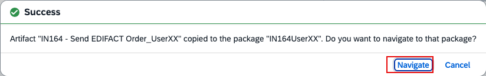
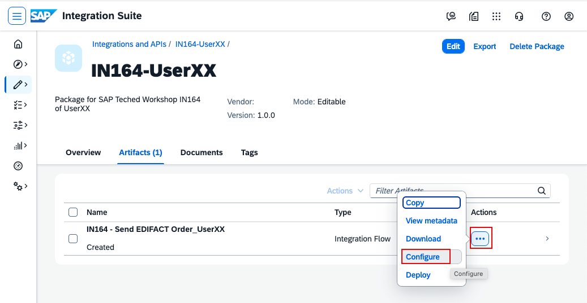
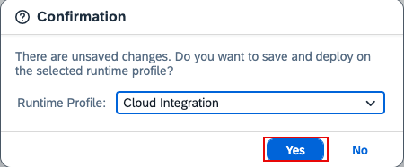

# IN164 - Exercise 2 - Create an iFlow for the test message and send the message

## Overview
In this exercise, you will copy an existing iFlow into your own package and configure it to simulate a trading partner.
Replace XX with your participant number wherever it appears.

Go to Design -> Integrations and APIs.

----

Create your own package by clicking Create.

----

Name the package IN164-UserXX (replace XX with your number).

----

Navigate to the package IN164-SimulatorFlow.

----

Open the Artifacts tab, click the three dots (...), then click Copy.

----

In the Copy dialog:
- Rename the iFlow to IN164 - Send EDIFACT Order_UserXX (replace XX with your number).
- Select your package IN164-UserXX (replace XX with your number).
- Click Copy.

----

To configure the copied iFlow, click Navigate to open the new iFlow.

----

Open Artifacts, click the three dots (...), then click Configure.

----

In the Configure screen:
- Set UserId to UserXX (replace XX with your number).
- Click Save, then Deploy.

----

Confirm the deployment by clicking Yes.
After deployment, the simulated trading partner will send an EDIFACT Order message.

----
Continue with: [Exercise 3 - monitor the message](Exercise-3.md)

Please give us feedback for this session **IN164**

