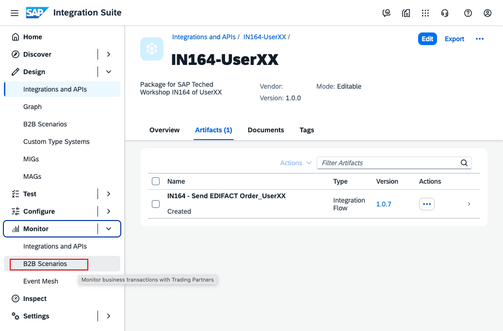
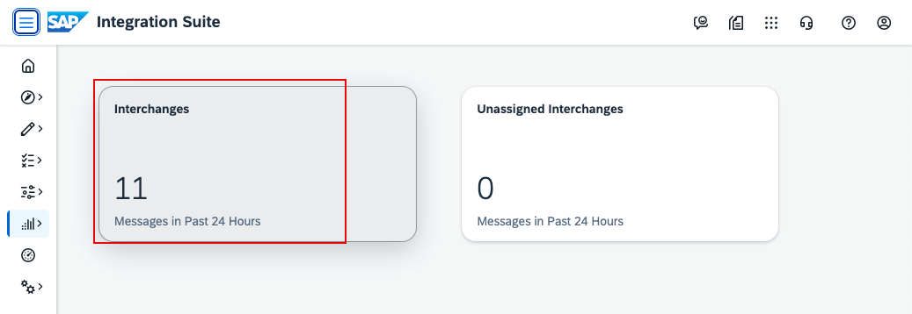
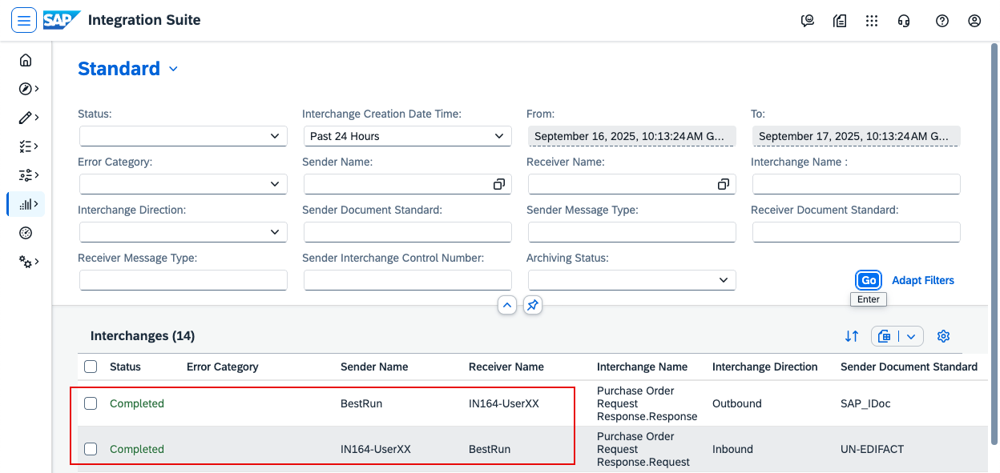
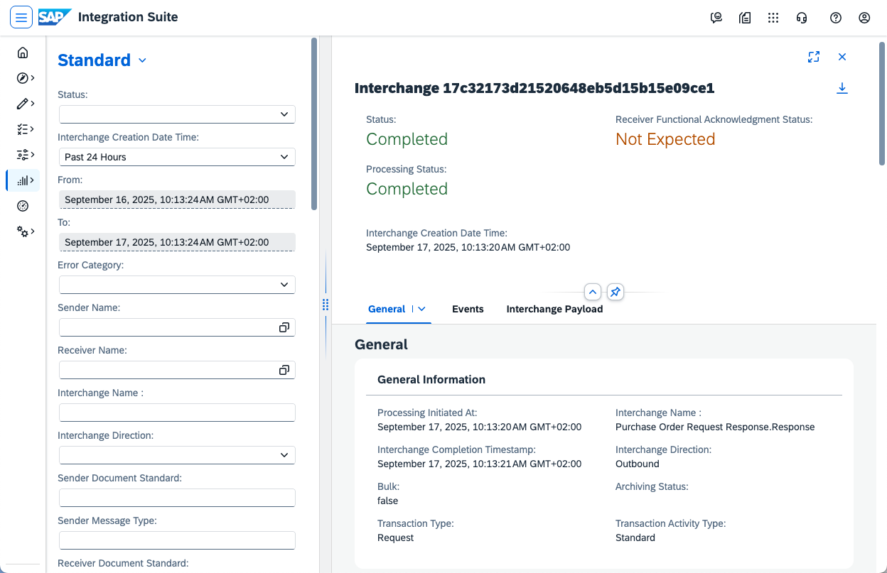

# IN164 - Exercise 3 - Monitor the message

## Overview
In this exercise, you will monitor the message you sent in the previous exercise.

Go to Monitor -> B2B Scenarios.

----

On this page, you’ll see an overview of messages. Click Interchanges.

----

This page offers many filtering and search options. Click Go to load the data.

----

In the list, you should find your interchanges (you can identify them by the involved trading partners). Open one of the messages that belongs to your participant number and review the details.

----
Continue with: [Exercise 4 - onboard the trading partner by copy](Exercise-4.md)

Please give us feedback for this session **IN164**

