# IN164 - Exercise 4 - Onboard the Trading Partner by Copying

Overview
If you create an agreement with the Bind option, you cannot modify the process or change the MIGs and MAGs. Because our trading partner needs slightly different MIG and MAG that you will create in the following exercises, we first need an agreement that allows you to modify the MIGs and MAGs. You can do this by instantiating the agreement from the template using the Copy option.

As usual: replace XX with your participant number wherever it appears.

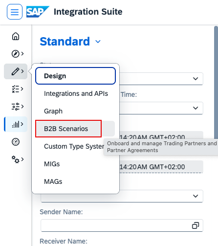
Go to Design -> B2B Scenarios.

----

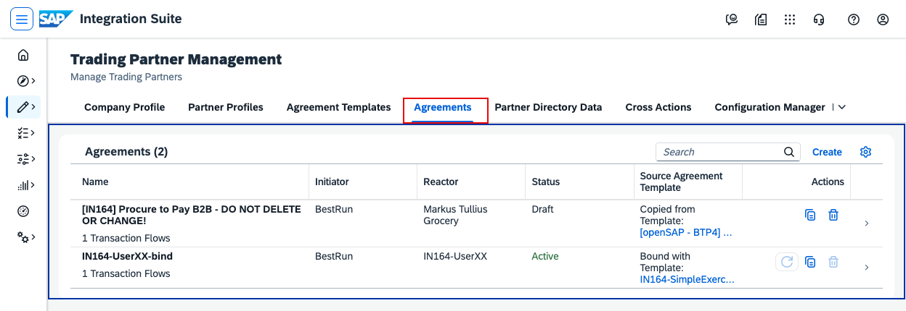
Go to Agreements and open your agreement (IN164-UserXX-bind).

----

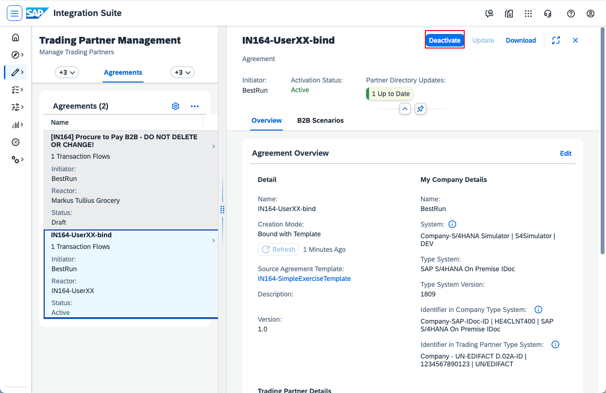
Because you want to create a new agreement for the same trading partner, first deactivate the bound one. Click Deactivate.

----

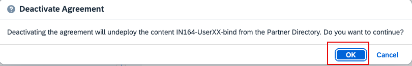
Confirm by clicking OK.

----

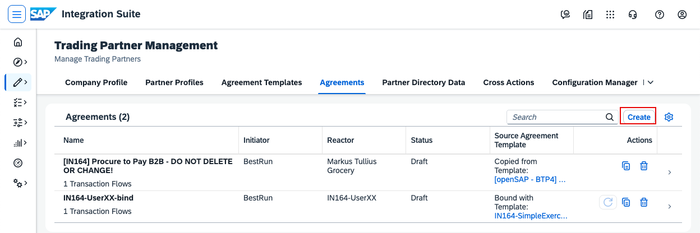
Click Create to create a new agreement.

----

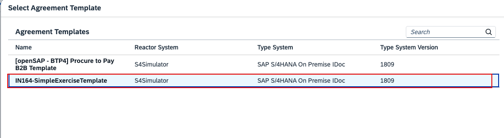
Select the same template as before: IN164-SimpleExerciseTemplate.

----

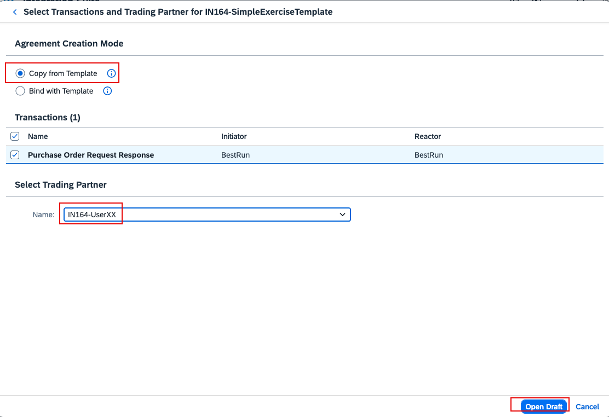
Choose Copy from Template, select your trading partner (IN164-UserXX), then click Open Draft.

----

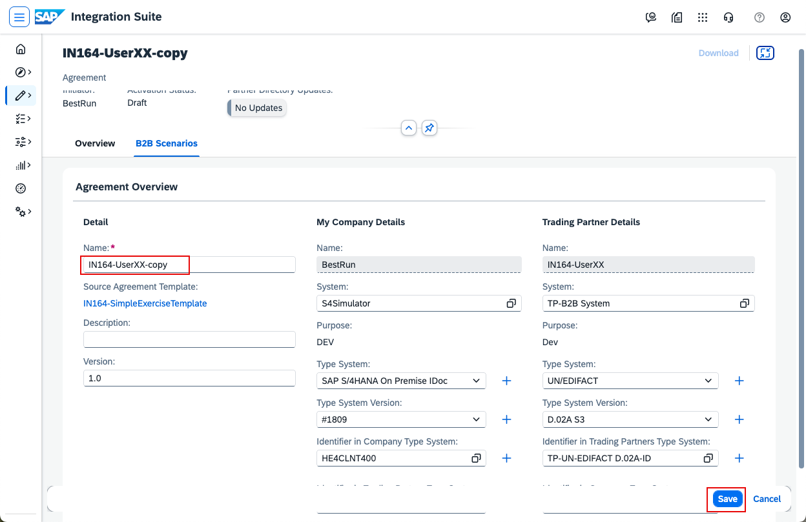
Name the agreement IN164-UserXX-copy, then click Save and Activate.

----

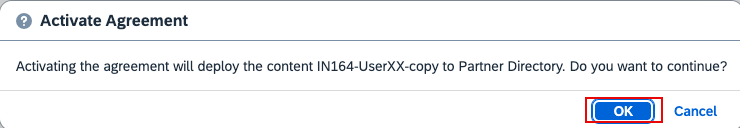
Confirm activation by clicking OK.

----

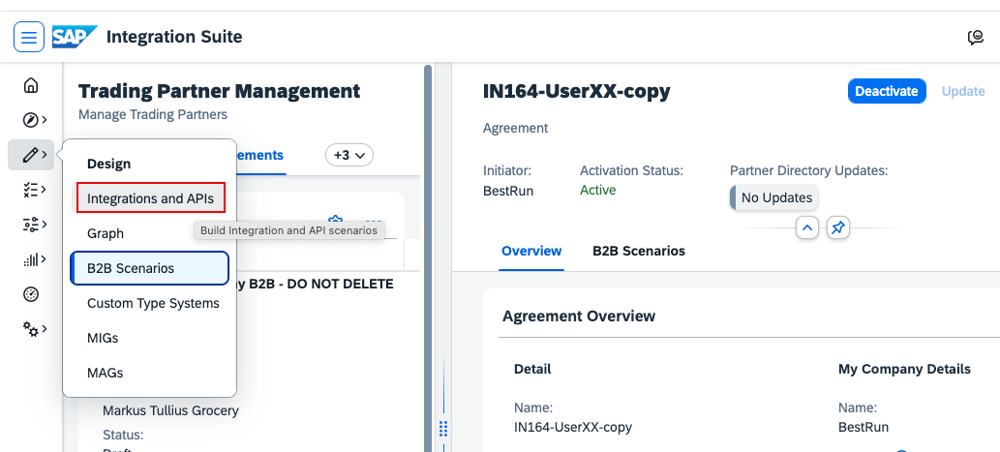
Before making changes, verify that the new agreement works. Go to Design -> Integrations and APIs.

----

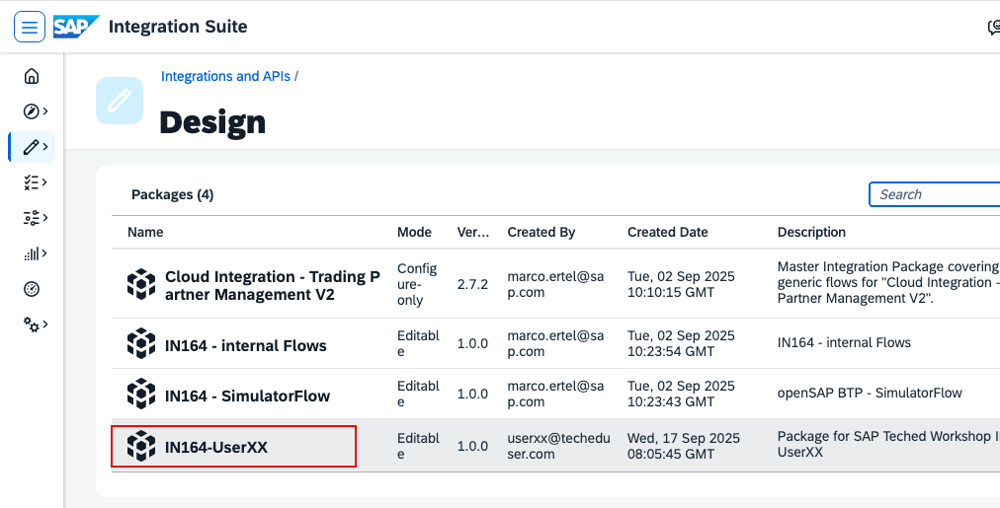
Open your package IN164-UserXX (replace XX with your number).

----

Go to Artifacts, click the three dots (...) on the iFlow, then click Deploy. This simulates the trading partner and sends an EDIFACT Order.

----

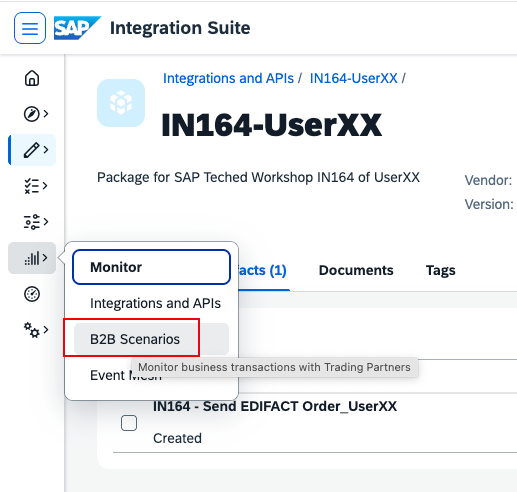
Go back to Monitor -> B2B Scenarios.

----

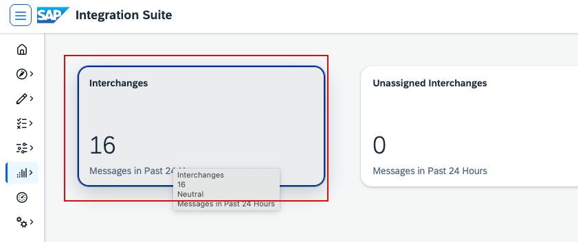
Click the Interchanges tile.

----

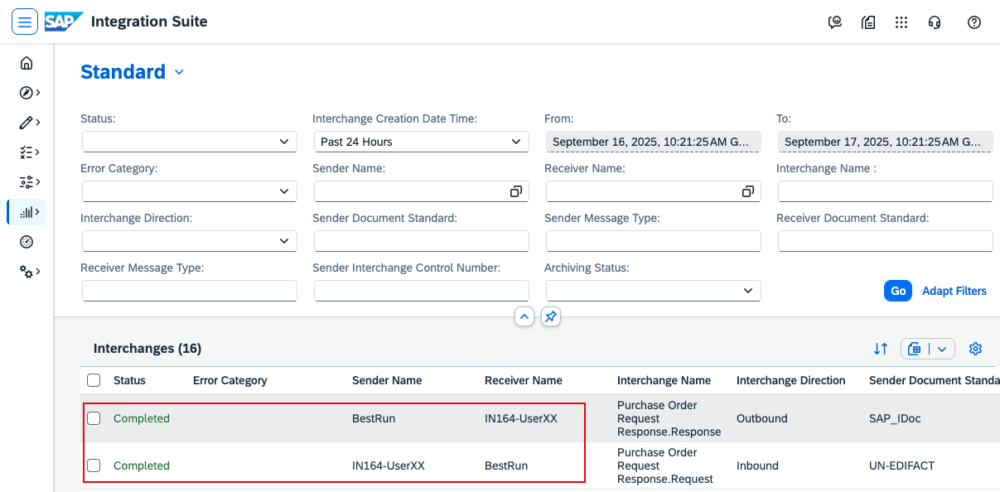
Click Go and check whether you can find the interchanges for your trading partner. You should see two lines: one for the incoming Order and one for the outgoing Order Response.

----
Continue with: [Exercise 5 - Create a New Message Implementation Guideline](Exercise-5.md)

Please give us feedback for this session **IN164**

