# IN164 - Exercise 5 - Create a New Message Implementation Guideline

Overview
In the next two exercises, you will create your own Message Implementation Guideline (MIG), followed by your own Mapping Guideline (MAG). These let you accommodate the structure of a message—often defined by your trading partner—and then create a mapping to it.
Here is the message your trading partner expects for the ORDRSP message:

```
UNB+UNOY:3+1234567890123:1+UNEDI_TP_E_UserXX:1+251029:1803+000150'
UNH+5220230+ORDRSP:D:02A:UN:DF0320'
BGM++0000347163'
DTM+11:20231007:102'
RFF+ON:20231004'
NAD+BY+8711389000001'
NAD+DP+0001000654+++201 1st St+Heinzdorf++758033'
CUX+2:USD'
LIN++5'
PIA+1+MZ-FG-S100'
QTY+21:8.000:PCE'
UNS+S'
MOA+203:158672.00:USD'
UNT+13+5220230'
UNZ+1+000150'
```

You will need this file in the MIG editor; download it here: [EDIFACT Ordrsp message](Payload/EDIFACT-Ordrsp-Overlay.edi.txt).

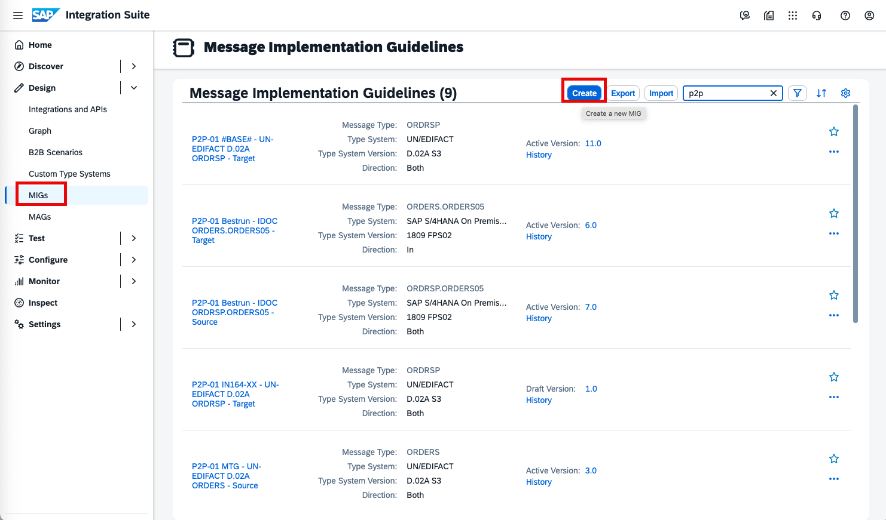
Start by navigating to MIGs (Design -> MIGs), then click Create to create a new MIG.

----

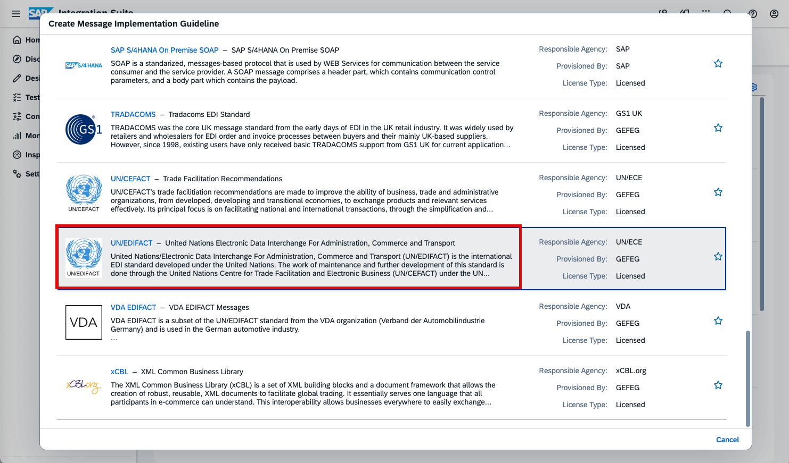
On the next screen, you will see the standards supported by Integration Advisor. Scroll down until you find UN/EDIFACT and select it.

----

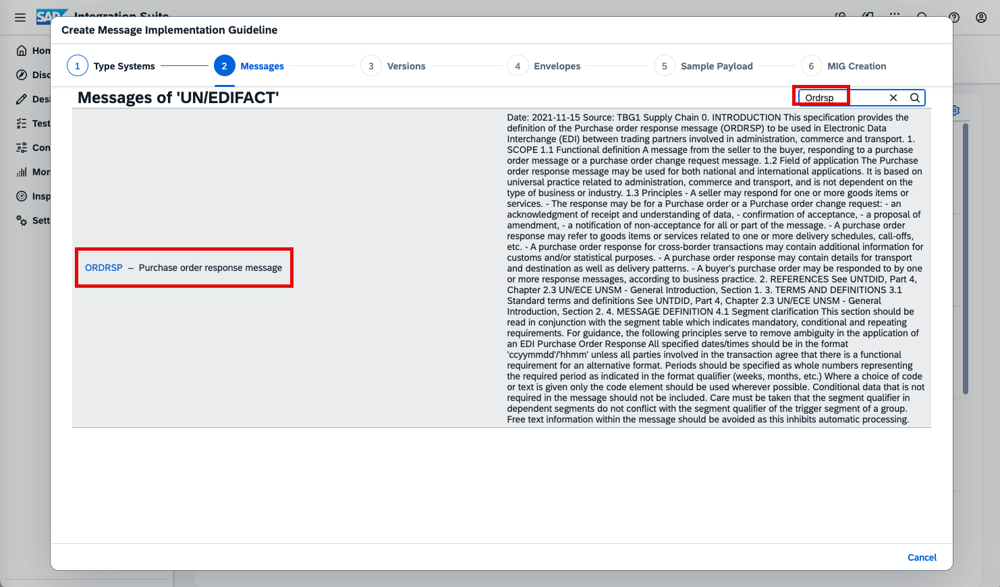
Because the standard contains many messages, search for ORDRSP and select it.

----

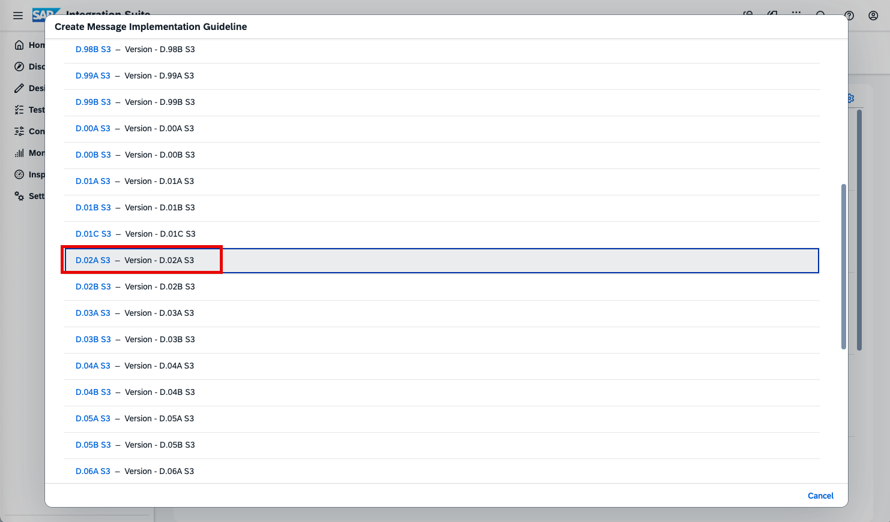
The EDIFACT standard has many versions. In our example, the trading partner expects version D.02A S3.

----

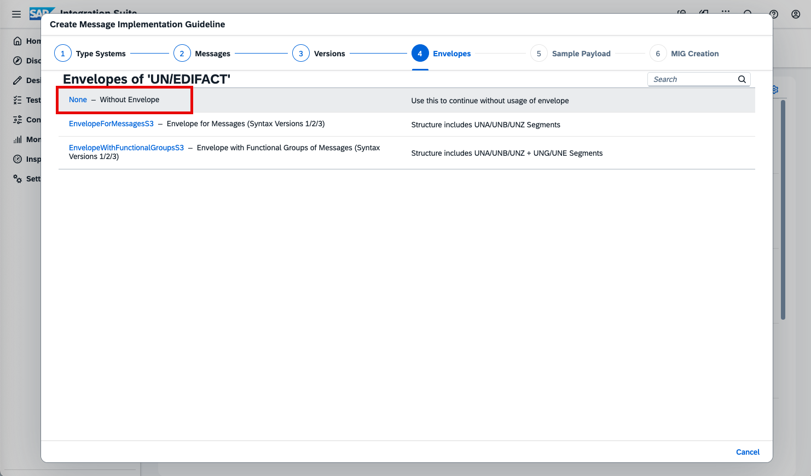
Because we do not want to modify the envelope, on the next screen select None so the envelope is automatically created by TPM.
For more detail on envelope handling, see this blog (https://community.sap.com/t5/technology-blog-posts-by-sap/using-edi-envelopes-in-integration-advisor/ba-p/13915328) and the TPM documentation (https://help.sap.com/docs/integration-suite/sap-integration-suite/envelope-handling-in-migs?locale=en-US).

----

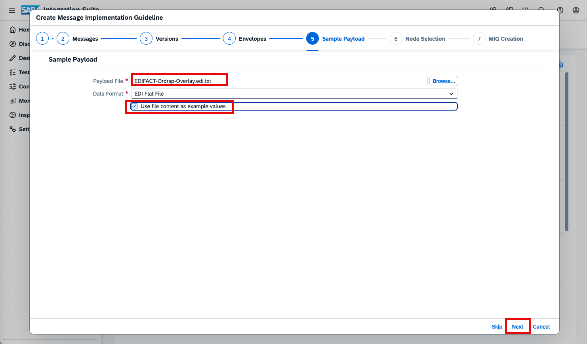
The next step can save a lot of time if you have the payload of your trading partner’s message (download it from Payload/EDIFACT-Ordrsp-Overlay.edi.txt and attach it using the Browse button). Using an existing payload validates qualifiers and used fields, and the content can be reused as example values.
Also select Use File Content as Example Values, then click Next.

----

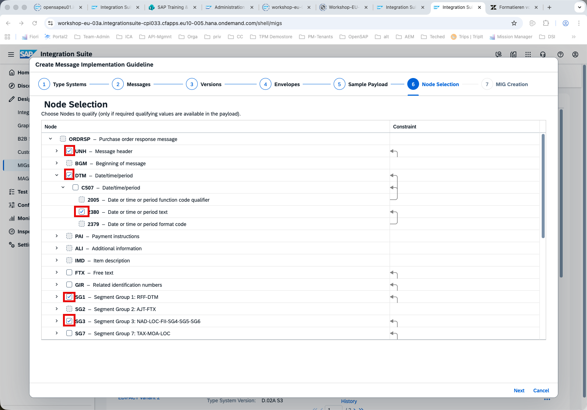
On this screen, select which qualifiers you want to set at each level. Qualifiers define the semantics of a node. For example, the DTM node is qualified with 11 here, which means this date is the expected dispatch or shipment date.
Select all the checkboxes marked in red in the screenshot:
- UNH
- DTM
- DTM->C507->2380
- SG1
- SG3

----

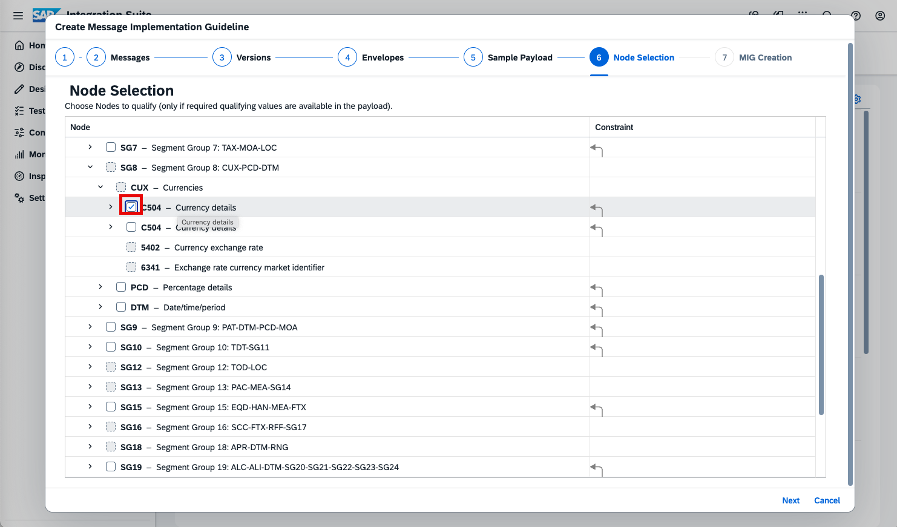
Continue by selecting the qualifiers for:
- SG8->CUX->C504

----

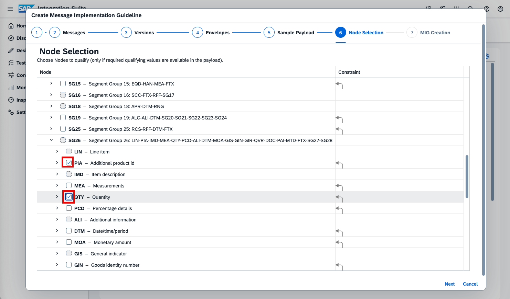
Continue by selecting the qualifiers for:
- SG26->PIA
- SG26->QTY

----

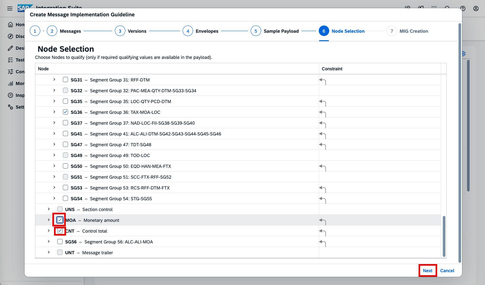
Continue by selecting the qualifiers for:
- MOA
- CNT

Be especially careful when selecting the qualifier for MOA: MOA exists both inside SG26 (do not qualify it there) and at the highest level.

Now that you have completed the qualification, click Next to continue.

----

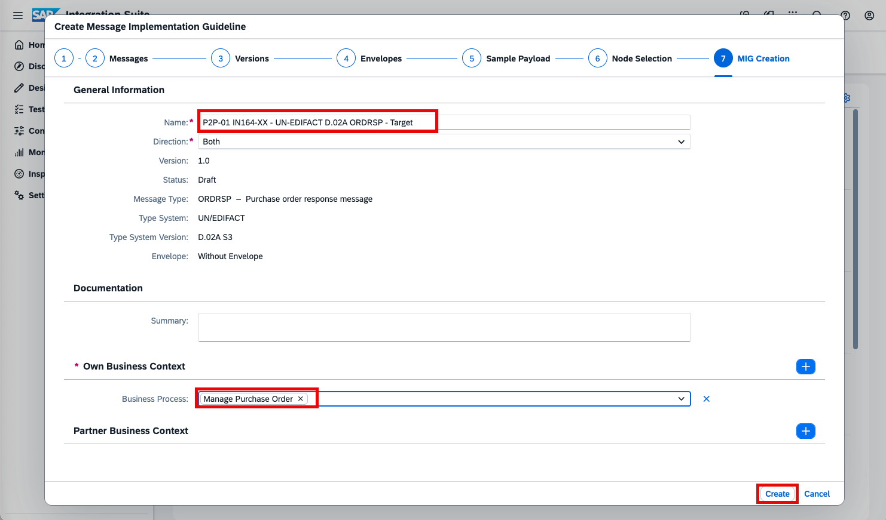
Provide the MIG name, direction, and business context.
Use the following naming scheme for the name: P2P-01 IN164-XX - UN-EDIFACT D.02A ORDRSP - Target (replace XX with your number).
Set Direction to Both and, for Own Business Context, select Business Process and then Manage Purchase Order.
Click Create to create the MIG.

----

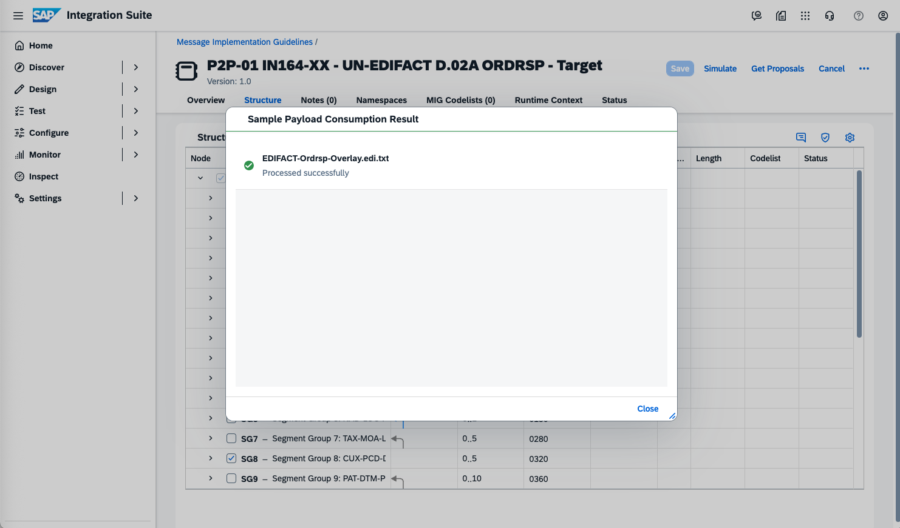
You should see a success message confirming that you have created a new MIG that matches your trading partner’s requirements.

----

Continue with Exercise 6 - Create a New Overlay Mapping (Exercise-6.md).

Please give us feedback for this session **IN164**


