# IN164 - Exercise 7 — Working with the Functional Acknowledgment

Overview

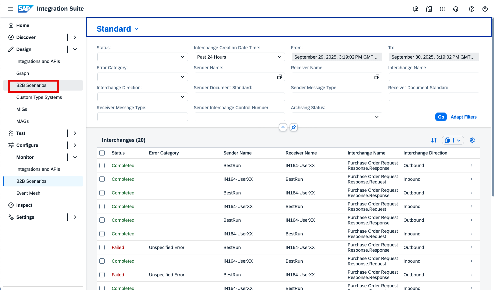
In the left-hand navigation, go to *Design* > *B2B Scenarios*.

----
----

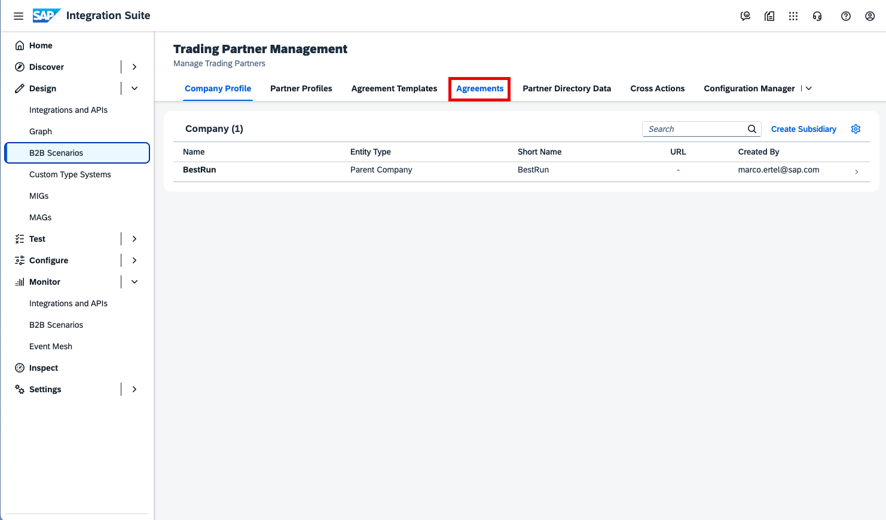
Open *Agreements* in *B2B Scenarios*.

----
----

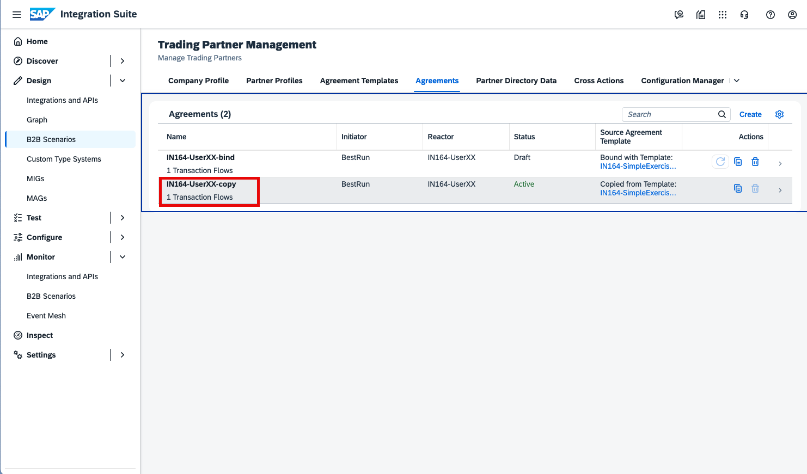
Open the *Trading Partner Agreement* between your partners (for example, IN164-UserXX and your counterpart).
Use your participant number (XX) where applicable.

----
----

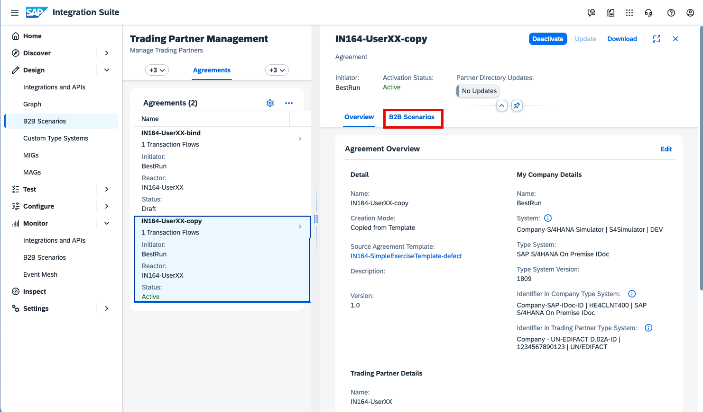
Within your *Trading Partner Agreement*, navigate to the *B2B Scenario* section.

----
----

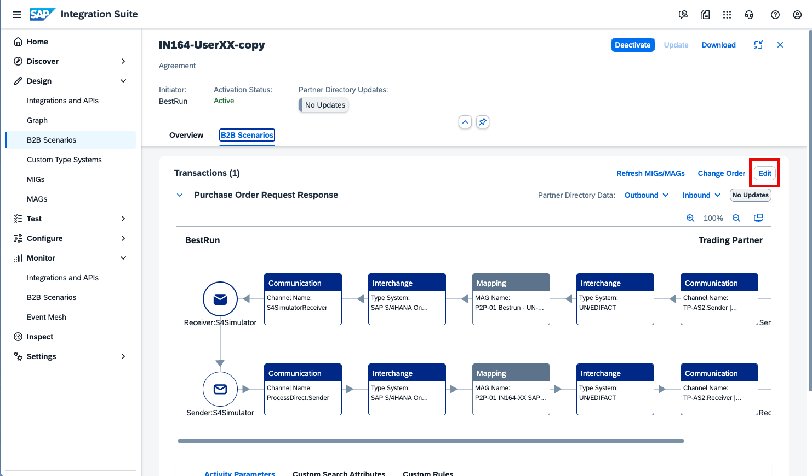
Switch the *Trading Partner Agreement* to *Edit* mode to modify the *Functional Acknowledgment* settings.

----
----

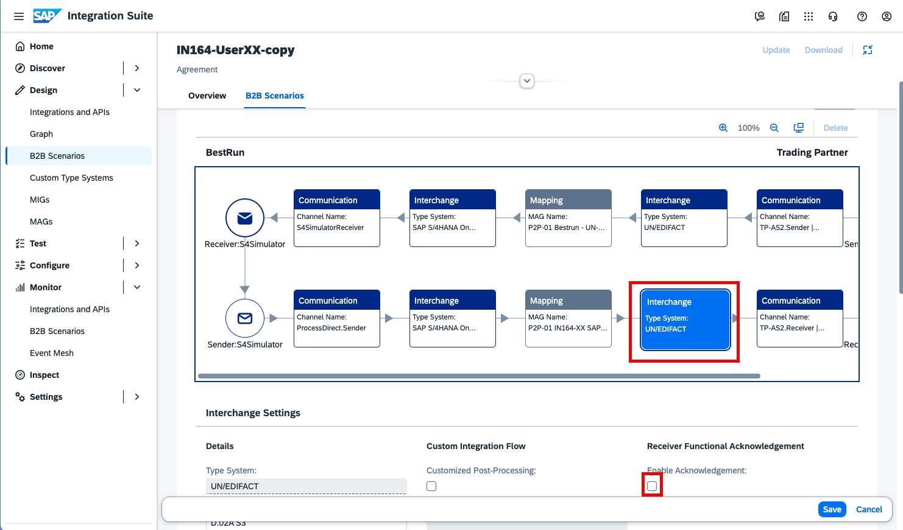
Select *Interchange (outgoing)* and check the *Receiver Functional Acknowledgment* checkbox.

----
----

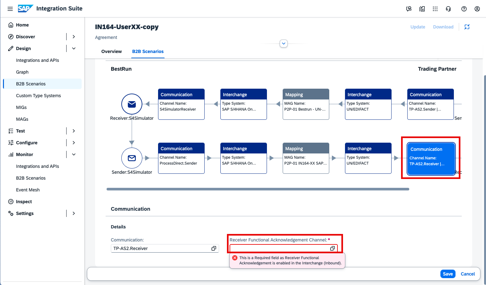
Go to the *Communication* tab and set *Channel* to the endpoint through which your trading partner will send the CONTRL message.

----
----

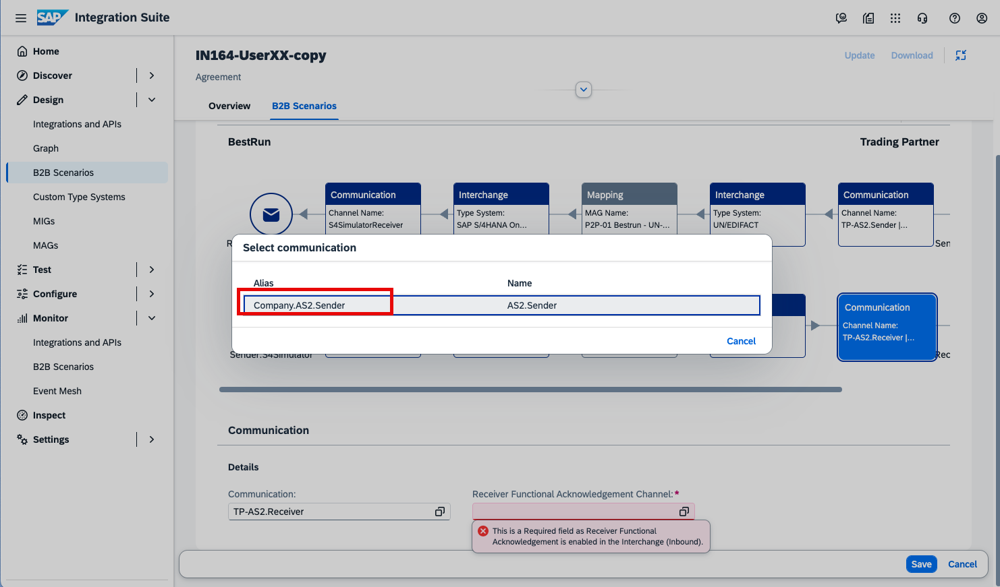
The channel is already prepared. Select *Company.AS2.Sender*.

----
----

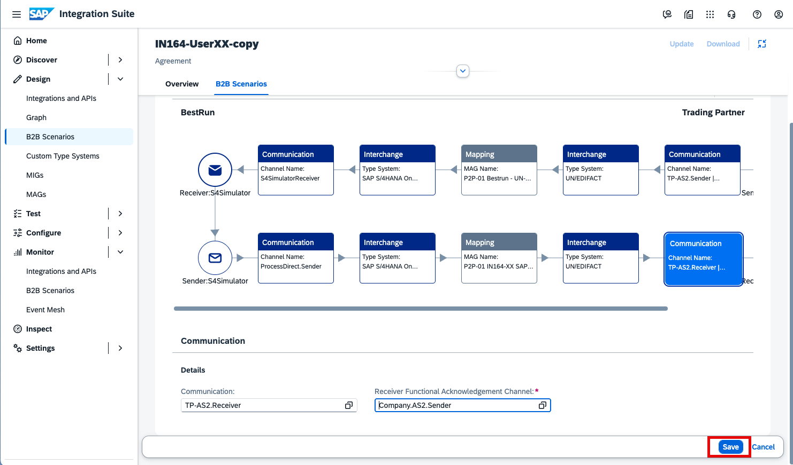
Click *Save* to store the changes to the *Trading Partner Agreement*.

----
----

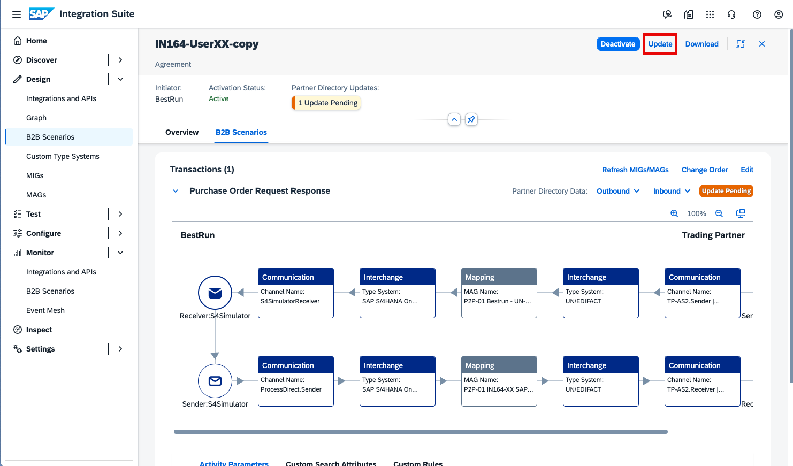
Click *Update* so the changes are written to the *Partner Directory*.

Then send a test message (by deploying the *Integration Flow (iFlow)* in the *Package* you copied). After that, open the *B2B Monitor* to view the status of the *Functional Acknowledgment*.

----
----

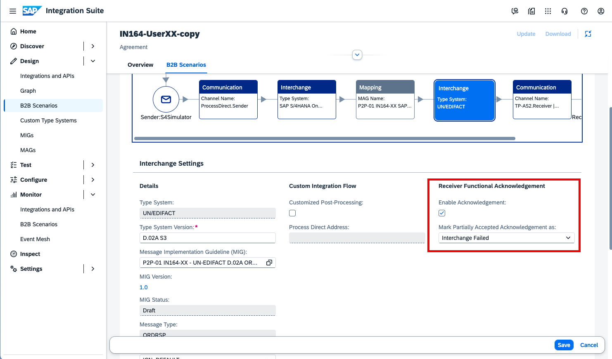
Because the CONTRL message your trading partner sends back is a partial acknowledgment, you can adjust the setting that controls how this partial status is displayed in monitoring. Change the setting and send another message to see the different behavior.

Congratulations — you have finished the TechEd exercise!

Please give us feedback for this session **IN164**

